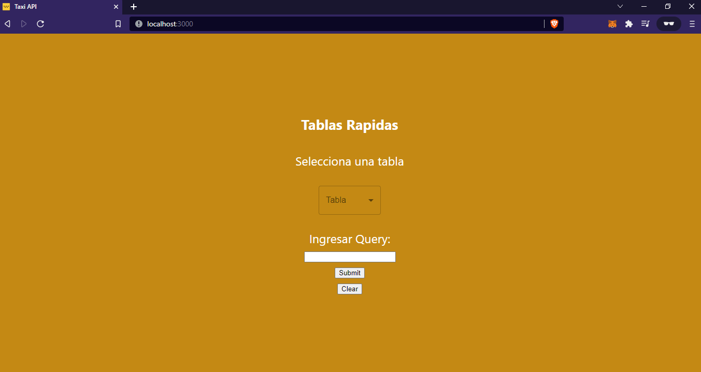
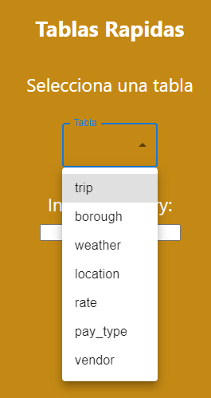
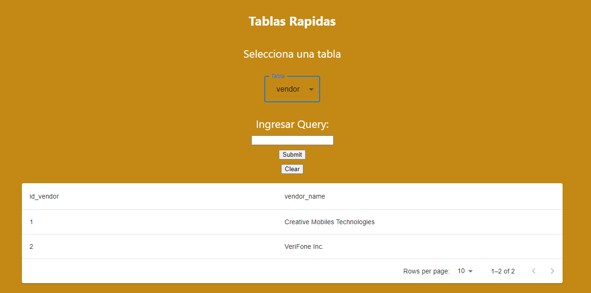
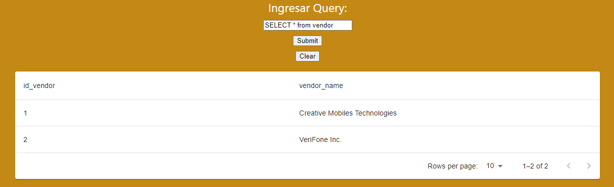
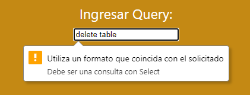

# App - Demo

Aqui se pueden encontrar dos carpetas donde esta separado un servicio para el Backend => Consultar a la API y base de Datos, además del Frontend => Visualizar los resultados que pueden ser consumidos.

Es necesario poder levantar cada servicio por medio de la consola de comandos.

## Backend - API

### __Descripción__

La siguiente es la documentación de la conexión hacia la base de datos a traves de una API.

Ha sido creada con un backend en Python, con la librería FastAPI y el código se encuentra en el archivo __consulta.py__

Las rutas o endpoints para poder acceder a los dato son:

- GET: URL/query/

Esta ruta es para hacer el envío de la consulta hacia la base de datos, solo permite opciones de SELECT, no estan permitidas otras opciones que puedan alterar los datos.

- GET: URL/model

Haciendo el llamado a esta dirección, se puede descargar el archivo .SAV del modelo de datos aplicado en la página [Demostración consumible del modelo de Machine Learning](https://mangoru-taxi-trips-amount-prediction-streamlit-app-0z2yr7.streamlitapp.com/)

### __Pasos para iniciar el Servidor__

Primero realizar la instalación de las dependencias en la PC o Computador que será el nuevo servidor desde la dirección donde se encuentra el archivo __requirements.txt__ para efectos del proyecto se encuentra en una máquina distinta a la usada en el proyecto.

``` python
pip install -r requirements.txt
```

O usar:

``` python
pip3 install -r requirements.txt
```

Depende de la versión pip instalada en el servidor.

Luego ir hacia la ruta donde se encuentre el archivo __consulta.py__

``` python
cd /[directorio]/
```

Finalmente, iniciar el servidor por medio de CMD

``` cmd
uvicorn [nombre_archivo_sin_py]:[nombre_del_objeto_en_el_archivo] --host [URL_maquina] --port [puerto_a_usar]
```

Ejemplo, como ha sido usado en el proyecto

``` cmd
uvicorn consulta:app --host 45.56.77.151 --port 8080
```

### __Return o Respuestas de las llamadas a la API__

- GET: URL/query/

Devuelve los datos en un Array (Javascript) o Lista (Python) con cada resultado de la consulta formato JSON de la forma:

``` javascript
[
    {'Columna': "Fila"},
    {'Columna': "Fila"},
    {'Columna': "Fila"},
    ...
]
```

Ejemplo:

``` SQL
SELECT COUNT(*) from trip
```

``` javascript
[
    {'count': 99999999}
]
```

- GET: URL/model

Ruta para poder descargar el modelo de Machine Learning desde el navegador. Regresa el archivo .sav

## Frontend - Demo

### __Descripción__

El siguiente es el código creado en React para poder crear una consulta a la Base de Datos, un producto adicional para apoyar la exposición del proyecto y como se pueden consumir los datos procesados en nuevos análisis.

### __Pasos para activar el Frontend desde una Máquina local o Remota__

Es requisito tener instalado NodeJS y npm para poder correr los archivos de dependencias y código React. Además de haber levantado el servidor de la carpeta API => consultas.py para que pueda hacer las consultas a la base de datos (Postgres).

- Primer paso, desde la carpeta del repositorio, hacer lo siguiente:

``` CMD
$ /[dirección_del_repo] npm install
```

De esta manera se instalan todas las dependencias necesarias para el proyecto.

- Luego de que haya finalizado la instalación, desde la carpeta del repositorio, hacer lo siguiente:

``` CMD
$ /[dirección_del_repo] npm start
```

Asi puede iniciar el entorno de Desarrollo y se puede acceder desde la siguiente direccion URL en el navegador:

``` CMD
http://localhost:3000/
```

O en caso de haber activado el servicio desde la nube o maquina externa:

``` CMD
http://[URL o IP]:3000/
http://0.0.0.0:3000/
```



Es una página simple para poder hacer consultas y comprobar datos. La visual es solo la tabla de datos consultados. Se divide en dos partes.

Para un acceso a las Tablas Rápidas en la parte superior, solo es necesario que pueda seleccionar una tabla de las opciones desplegables.





Finalmente para poder hacer otro tipo de consultas, esta la opcion de "Ingresar Query". Asi se pueden realizar otro tipo de consultas hacia la Base de Datos - Postgres. Luego de escribir la consulta, hacer click en Submit y esperar los resultados.



Funciona solamente para consultas y no es posible realizar modificaciones a las tablas por medio de SQL.

Permite los siguientes formatos:

- "  SELECT ..." => Con solo letras mayúsculas y espacios al inicio de la linea
- " selelct ..." => Con solo letras minúsculas y espacios al inicio de la linea
- "SeLeCT ..."   => Mezcla de letras y sin espacios al inicio de la linea

No permite los formatos:

- "create ..."
- "Delete ..."
- "alter ..."


