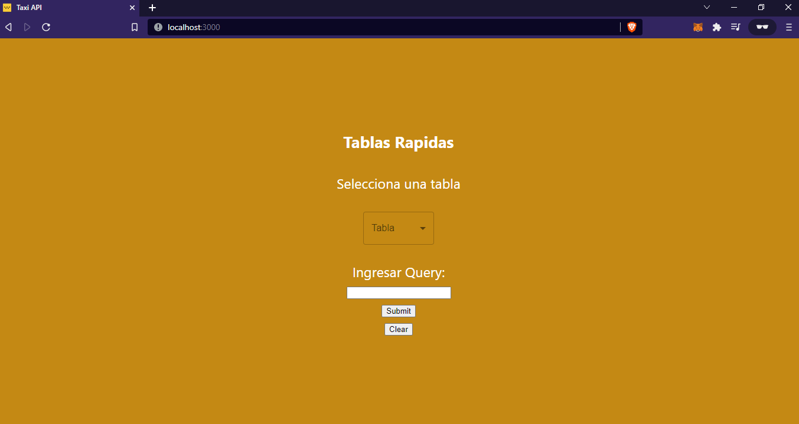
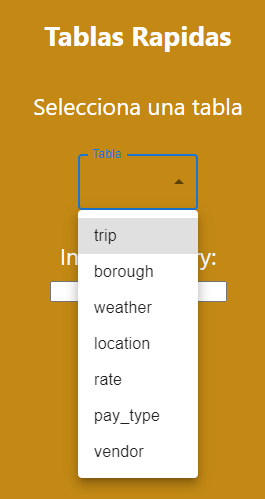
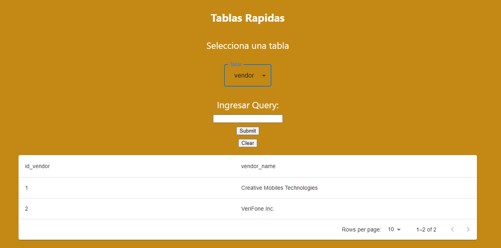
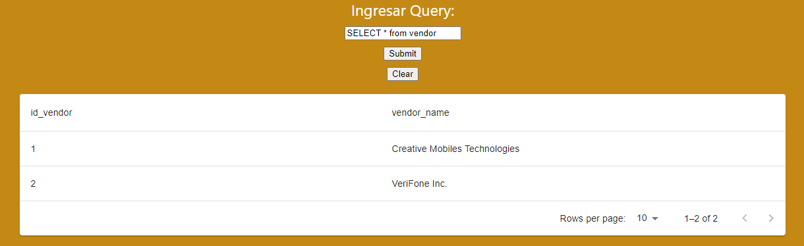
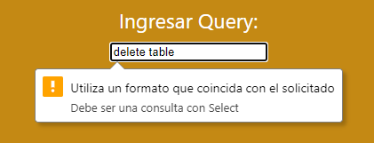

# Demostración - Frontend - Taxi API

El siguiente es el código creado en React para poder crear una consulta a la Base de Datos, un producto adicional para apoyar la exposición del proyecto y como se pueden consumir los datos procesados en nuevos análisis.

## Pasos para activar el Frontend desde una Máquina local o Remota

Es requisito tener instalado NodeJS y npm para poder correr los archivos de dependencias y código React.

- Primer paso, desde la carpeta del repositorio, hacer lo siguiente:

``` CMD
$ /[dirección_del_repo] npm install
```

De esta manera se instalan todas las dependencias necesarias para el proyecto.

- Luego de que haya finalizado la instalación, desde la carpeta del repositorio, hacer lo siguiente:

``` CMD
$ /[dirección_del_repo] npm start
```

Asi puede iniciar el entorno de Desarrollo y se puede acceder desde la siguiente direccion URL en el navegador:

``` CMD
http://localhost:3000/
```

O en caso de haber activado el servicio desde la nube o maquina externa:

``` CMD
http://[URL o IP]:3000/
http://0.0.0.0:3000/
```



Es una página simple para poder hacer consultas y comprobar datos. La visual es solo la tabla de datos consultados. Se divide en dos partes.

Para un acceso a las Tablas Rápidas en la parte superior, solo es necesario que pueda seleccionar una tabla de las opciones desplegables.





Finalmente para poder hacer otro tipo de consultas, esta la opcion de "Ingresar Query". Asi se pueden realizar otro tipo de consultas hacia la Base de Datos - Postgres. Luego de escribir la consulta, hacer click en Submit y esperar los resultados.



Funciona solamente para consultas y no es posible realizar modificaciones a las tablas por medio de SQL.

Permite los siguientes formatos:

- "  SELECT ..."
- " selelct ..."
- "SeLeCT ..."

No permite los formatos:

- "create ..."
- "Delete ..."
- "alter ..."


