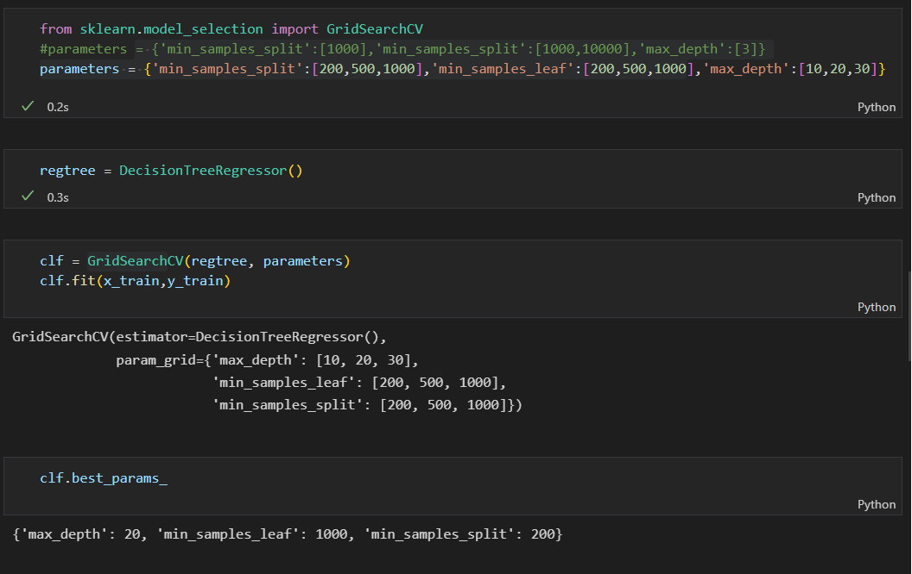
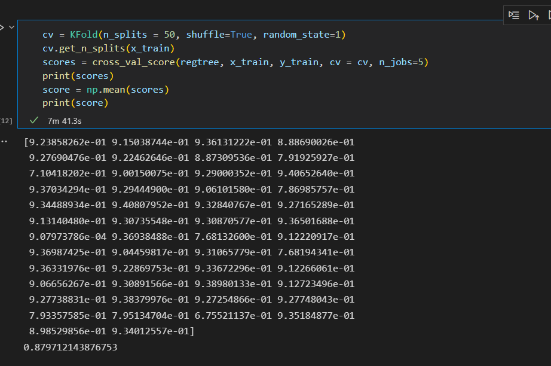
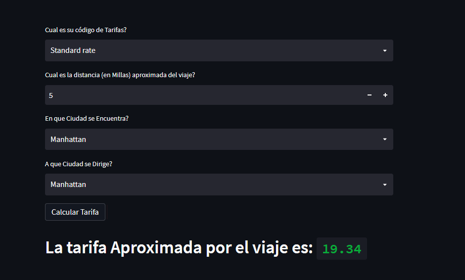

# Arbol de desicion

 

Ahora aplicaremos un modelo de machine learning para predecir la tarifa del viaje sin extras o propinas. De esta forma utilizaremos el algoritmo de machine learning llamado arbol de desicion.

 

**Paso 1** : Separamos los 26 millones de datos en 4 datasets distintos. 
 
    - X_train: donde tendremos el 80% de los registros y las columnas id_rate, trip_distance, pu_borough y do_borough. Estos registros seran los utilizados para entrenar el modelo.
 
    - Y_train: en este dataset tendremos solo la columna de fare_amount y el 80% de las filas. Este dataset sera la salida con la que el modelo se entrenara.
 
    - X_test: tendremos el 20% de los registros restantes y las colmunas id_rate, trip_distance, pu_borough y do_borough. Con este dataset predeciremos que tan bien trabaja el modelo.
 
    - Y_test: en este dataset tendremos la columna fare_amout y el 20% de las filas restantes. Con este dataset compararemos los resultados del modelo.

 

**Paso 2**: Utilizamos el GridSearch para la optimizacion de los hiperparametros del arbol de desicion, a este modelo le entregamos una lista de valores de hiperparametros y el modelo itera hasta encontrar el mejor.

 

**Paso 3**: Teniendo los mejores hiperparamentros para el modelo observamos que la medida de la calidad del modelo que estabamos utilizando R2 variaba mucho entre una ejecucion y otra. Por lo tanto decidimos realizar una validacion cruzada, para que con diferentes secciones de Train y Test realice un promedio y nos devuelva un valor mucho mas confiable de R2.

 

**Paso 4**: Exportamos el modelo y lo cargamos en un streamlit para poder realizar las predicciones de las tarifas desde ese mismo lugar

Link aplicaicon para predecir la tarifa: https://mangoru-taxi-trips-amount-prediction-streamlit-app-0z2yr7.streamlitapp.com/

