# NYC TAXIS & WEATHER API

A passenger transport service company that is currently operating in the medium and long-distance bus sector is interested in investing in the passenger car transport sector.

Since it would be a new business unit, it is intended to make an analysis of the movement of taxis in the city of New York, in order to obtain a reference and be able to make well-founded decisions.

The objective is to accompany the business in this decision-making process, for which the data provided (2018/01 yellow taxi trip records) will be collected.

In order to better understand the data, we may provide the following:

* Trip data --> https://www1.nyc.gov/site/tlc/about/tlc-trip-record-data.page
* Weather API --> https://www.visualcrossing.com/weather-api
* What is a Borough? --> https://en.wikipedia.org/wiki/Boroughs_of_New_York_City
* NYC zones file --> taxi+_zone_lookup.csv

Borough, Latitude, Longitude<br>
* Manhattan, New York City, NY, USA (40.776676, -73.971321)
* Brooklyn, New York City, NY, USA (40.650002, -73.949997)
* Bronx, New York City, NY, USA (40.837048, -73.865433)
* Queens, New York City, NY, USA (40.742054, -73.769417)
* Staten Island, New York City, NY, USA (40.579021, -74.151535)

<br>

# Exploration of the NYC Taxis dataset January 2018

The extraction of the data has been carried out from [this source](https://www1.nyc.gov/site/tlc/about/tlc-trip-record-data.page). This has been the initial load of data and exploration.

The table contains almost 8.7 million records and 19 columns of which there are two ["congestion_surcharge", "airport_fee"] with 99.9% null values.

In the table with the column "airport_fee" it has been decided to eliminate it because it does not add value to the data, since it refers to a fee and its values ​​are zero, therefore it is irrelevant for the analysis.

Now with the second column "congestion_surcharge", as it is a rate that is applied to delays due to congestion, it has been decided to convert the __Null__ values ​​into __Zero__, in this way it can be used in other analyzes if congestion occurs or not in the taxi trip.

The company that has made the most trips in the month has been __VeriFone Inc.__ with more than 4,914,553 compared to __Creative Mobile Technologies__ with 3,846,134

A column called "Travel Time" has been created to know if there are values ​​that are not real or positive. These negative values ​​have been converted to Zero and the travel times that have exceeded 100,000 seconds were converted to Zero because they represent more than 1 day of travel.

## Travel Time - with Outliers

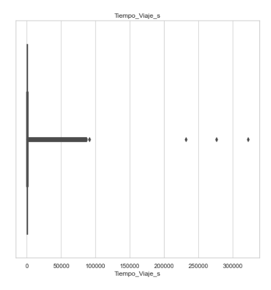

## Travel Time - without Outliers

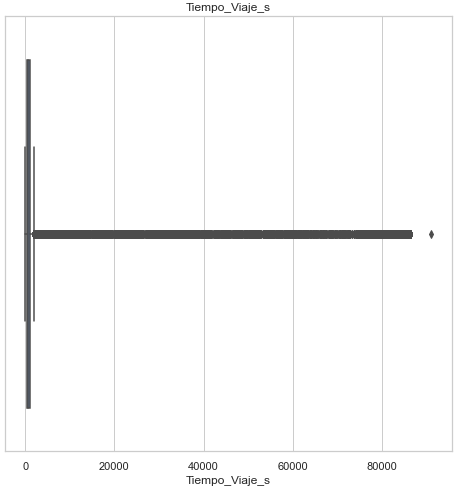

Another observation has been the trip distance or "trip_distance" where the outlier values or greater than 25,000 miles were considered as errors in the registry, and were converted to Zero. Because they are higher distances, for example a record that has more than 175,000 miles traveled.

## Travel Distance - with Outliers

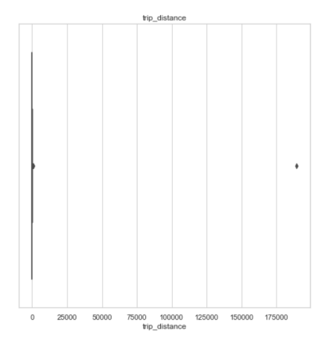

## Travel Distance - without Outliers

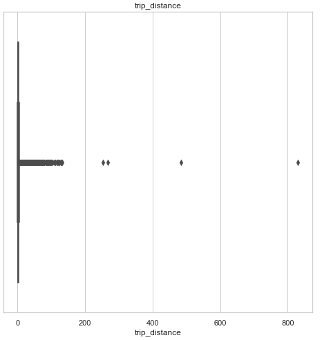

In the columns related to rates and surcharges such as the following:

- fare_amount
- extra
-mta_tax
- tip_amount
-tolls_amount
- improvement_surcharge
-total_amount

It has been detected that there are negative values and there are options that have been considered, the first is that there are erroneous records and other values that may be discounts (Consult). Therefore, it has been decided to convert all the records to positive so as not to lose the data, since it is useful for analysis. As a recommendation, to be able to add an additional column that can be called "Discounts".

## Fare amount 

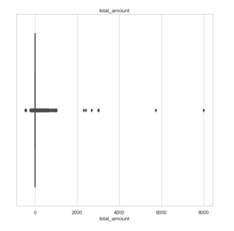

## Fare amount + tip

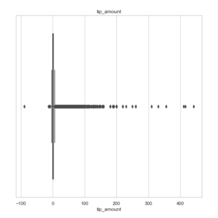


## Borough Value Correction

In this section we decided to remove 189 thousand values ​​from the Taxis table since the elements do not connect to the Borough table. We don't have Borough, Zone, latitude or longitude.

## Correction of Rate values

We see in the data dictionary that we have 6 different Rate_Code values, but in the data analysis we see a seventh. Value 99 containing about 30 data. We decided to eliminate this data since it is an impediment when making connections to the datawarehouse.

<br>

#Data warehouse
When building the database, we decided to work with postgresql and airflow. All these processes will be mounted in docker.
To begin with, we investigate the airflow documentation and download the docker_compose file that airflow brought and the postgresql we work with. With postgresql we build the database with its tables, primary keys and foreign keys. We will use the airflow to orchestrate the automation of the process from the ETL (with work on remote values ​​and nulls) as well as the creation of the tables and the loading of the data.

<br>


<br>

## Creation of the database
We work with the __trip_data__ table that will have all the data obtained from the Taxis.csv dataset, it will have a primarykey called "id_trip_data".
trip_data has 5 foreign keys:
<br>
- __Rate:__ Enter id_date_code from the trip_data table and id_rate from the rate table. Accounts for the types of travel fares
- __Pay_tipe:__ Enter id_pay_tipe from the trip data table and id_pay_tipe from the pay_tipe table. It accounts for the payment methods of the users.
- __Vendor:__ Enter id_vendor from the trip data table and id_vendor from the vendor table. Account the company that made the trip.
- __Localtion:__ With this table we have a double foreign key. The first for the pu_location column and the second for do_location both from the trip_data table and connect to the id_location column in the location table. In these columns we are showing the location of the taxi at the beginning of the trip and the location at its end.

<br>

To continue we have the __weather__ table, this table has a primary key called id_weather, which reports on each of the weather situations in the corresponding places in a period of one hour. It also has 1 foreign key:
<br>
- __Borough:__ The id_borough column from the weather table with the id_borough table from the borough table. To coordinate the location of each climatic situation registered in its corresponding table.


Finishing the analysis of the foreign keys we have the table __borough__, where the primary key is the id_borough and has a foreign key:
<br>
- __Location:__ The id_borough from the borough table with the id_borough column from the location table. To coordinate the hierarchies between the boroughs and the zones.

<br>

We also have the tables __calendario__ where the primary key is the date, and we have the columns on day, week, month, quarter, etc.

The __location__ table where we organize the hierarchies and the relationships between the zones and the boroughs.

The __rate__ table where we write down the types of rates, the __pay_tipe__ table and the __vender__ table where we see the company that made the trip.

<br>

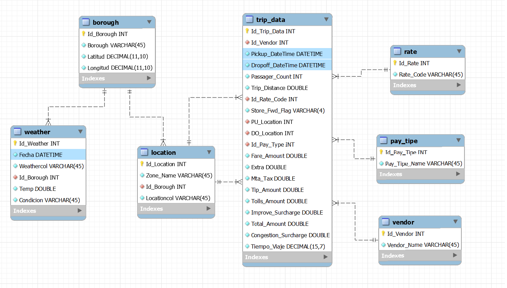

<br>

# Business rules
<br>

1. Taxi units must be able to provide travel service to their passengers.

The date and time of **tpep_dropoff_datetime** cannot be less than **tpep_pickup_datetime**.

```python
if **tpep_dropoff_datetime** < **tpep_pickup_datetime** = DROP
```

The values ​​in the distances in **trip_distance** must be positive.

```python
if **trip_distance < 0 = abs(trip_distance)**
```

1. The passenger must be able to request a taxi unit for their trip.

The values ​​in the **fare_amount** fare must be positive.

```python
if **fare_amount** < 0 = abs(**fare_amount**)
```

1. Trips must take place in existing zones and neighborhoods.

The pick-up **pu_location** and drop-off **do_location** locations for each trip must belong to a location in the **location** table.

```python
**taxis**[**pu_location**] is not **location**[**id_location] =** DROP
**taxis**[**do_location**] is not **location**[**id_location] =** DROP
```

1. Fares are established by a code given by the final location of the trip.

The rate code of each trip **ratecodeid** must be in a range from 1 to 6.

```python
if **ratecodeid** < 1 and **ratecodeid >** 6 = DROP
```

1. The passenger can decide their preferred payment method.

The payment code of each trip **id_payment** must be in a range from 1 to 6.

```python
if **id_payment** < 1 and **id_payment >** 6 = DROP
```

1. Each trip generates a profit depending on the rate given.

The value in **total_amount** must be greater than or equal to **fare_amount**.

```python
if **total_amount < fare_amount =** DROP
```
<br>

# Incremental loading of data

<br>

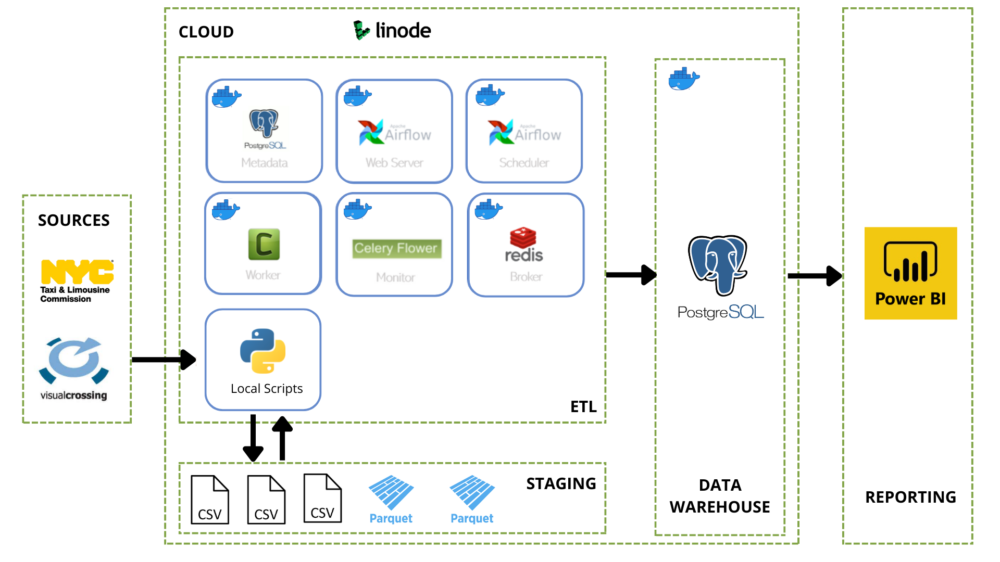

<br>

For the incremental loading process of the following months we have decided to use airflow services, since with this technology we can execute the extraction, loading and transformation of our data step by step and in time intervals.
<br>

We will also create a database in postgresql that we will connect with airflow.
<br>

Step 1: We create the scheme.
<br>

Step 2: We load the Vendor, Rate, Payment, Borough and Location tables (Tables that will be created and loaded only once)

<br>

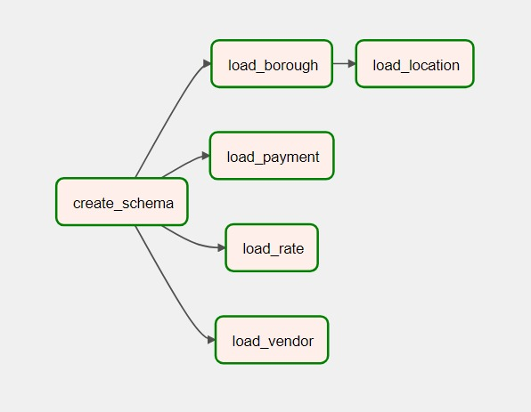

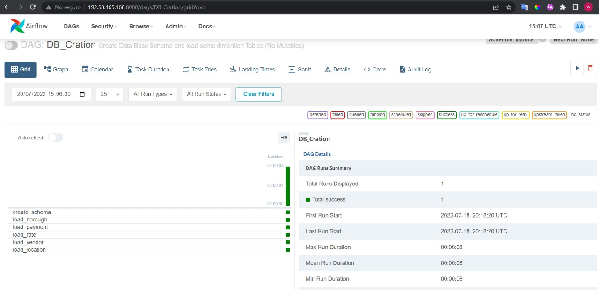

<br>
Step 3: Then two processes the ETL_taxi_trips and ETL_weather are executed.
<br>

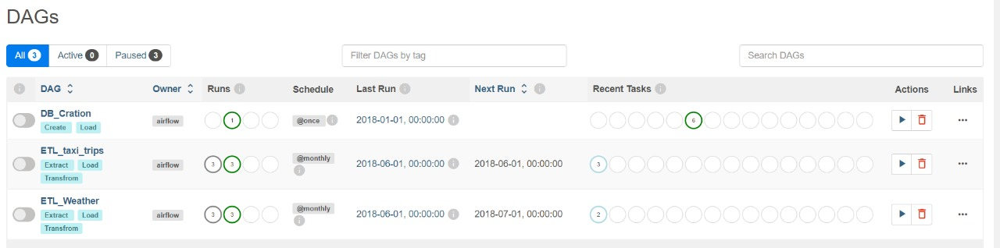

Step 4: The ETL_taxis_trips process has 3 stages, extracting the data from the page (extrac_trip), transforming the data with python (transform_trip) and loading the data to the postgressql database (load_trip).

<br>

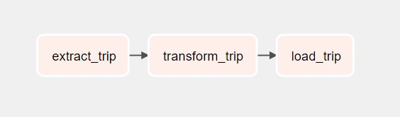

Step 5: The ETL_weather process has 2 stages, extracting and transforming the data from the page (extract_transform_weather) and loading the data to the base in postgressql (load_weather).

<br>

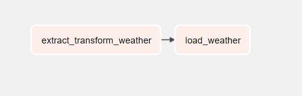

<br>

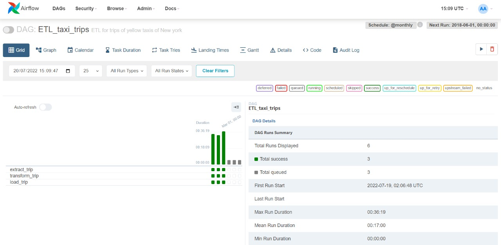

<br>

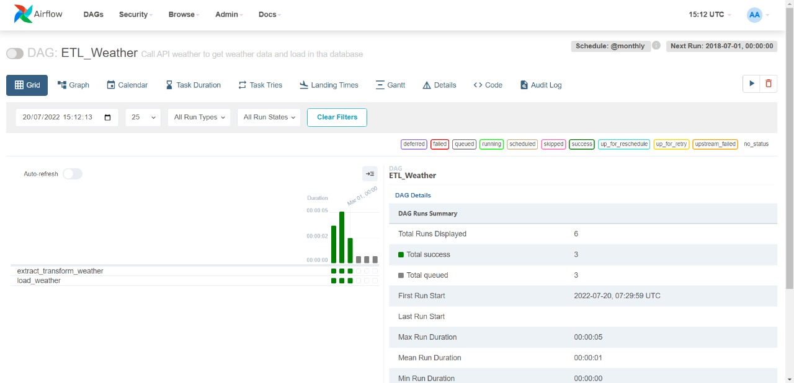


<br>

# Analysis in Power BI

In this section we will carry out a graphical analysis of the data and we will seek to obtain some conclusions about investment steps to follow.

Report in Power BI (interactive): https://community.powerbi.com/t5/Data-Stories-Gallery/Analisis-del-movimiento-de-los-taxis-en-Nueva-York/td-p/2654356

<br>
We observe that between the months of January-February-March we have 26 million records with 4000 trips per day. The trips are distributed in 5 zones, the average duration of the trip is approximately 15 minutes and the average fares are $12.14.

<br>

When analyzing a possible incursion into the taxi market, we believe that the most important data is the location. More than half of the taxis leave from the Manhattan area.
This region has 12 times more trips than the other 4 together and generates 4.5 times the revenue of the other 4 zones combined. Therefore, if there is a location where it is recommended for a company to start, it is in Manhattan.
<br>

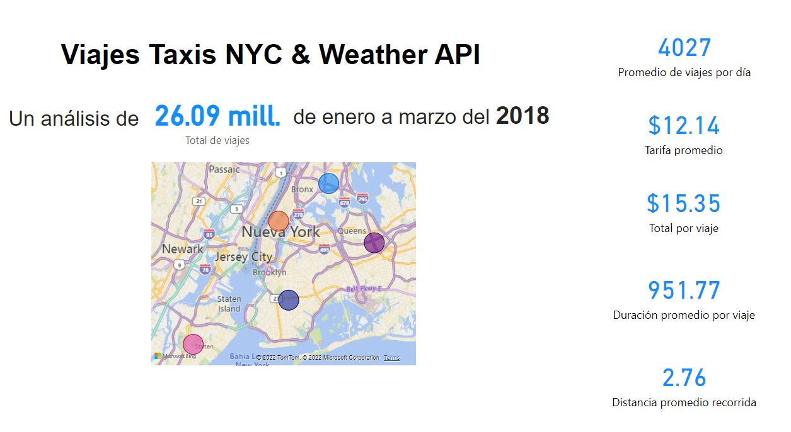

<br>

It is also important to consider the working hours of the company. We find the time slot from 8 am to 11 pm important, since it is the time when there will be more taxi requirements and it could be more profitable.
Considering also that a day where the consumption of taxis in quantity and money are lower is Sunday.

<br>

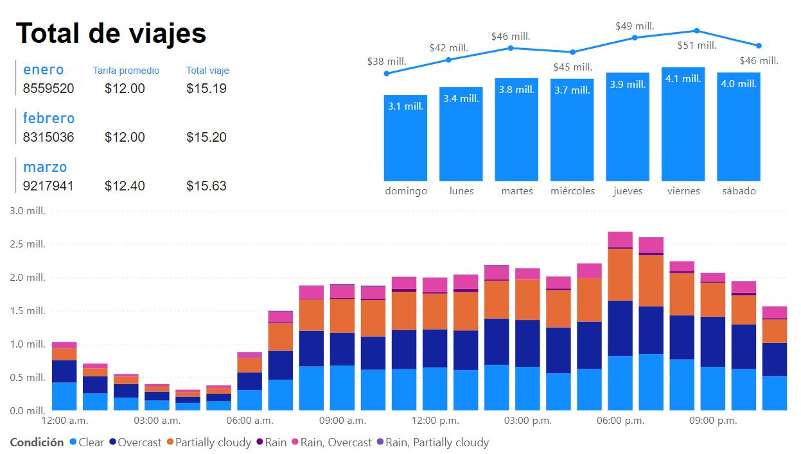

<br>

In the analysis by zones we can once again observe the wide margin of advantage between Manhattan and the rest. We can also note that weather conditions do not usually have a strong impact on the demand for taxis.

<br>

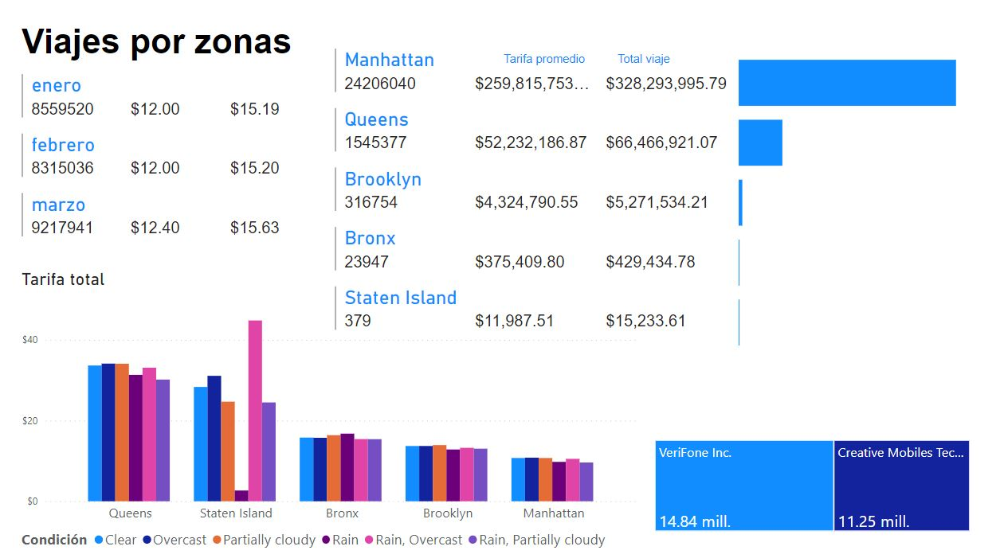

<br>

In this section we see the importance of accepting payment by card, almost an exclusive requirement. If not, they could see the company's income greatly reduced. When analyzing the types of rates, we consider that it is important to have considerations for trips to the airport, these cases will be by far scarce.

<br>

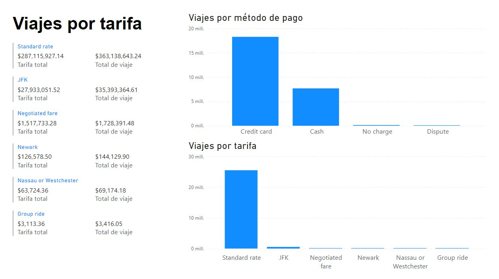

When analyzing the situation by climate we see a clear trend. The largest number of taxis are required when temperatures range between 30ºF and 45ºF. But when we leave that temperature range, the values ​​of taxi use drop a lot, remaining relevant in the 15ºF-30ºF and 45ºF-60ºF ranges. But becoming almost insignificant in the ranges below 15ºF or above 60ºF.

<br>

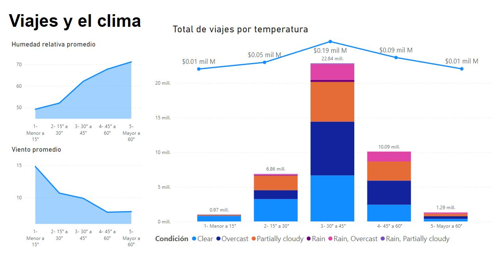

<br>

# Decision tree

<br>

We will now apply a machine learning model to predict the trip fare without extras or tips. In this way we will use the machine learning algorithm called decision tree.

<br>

**Step 1** : We separate the 26 million data into 4 different datasets.
<br>
    - X_train: where we will have 80% of the records and the id_rate, trip_distance, pu_borough and do_borough columns. These records will be used to train the model.
<br>
    - Y_train: in this dataset we will only have the fare_amount column and 80% of the rows. This dataset will be the output with which the model will be trained.
<br>
    - X_test: we will have 20% of the remaining records and the id_rate, trip_distance, pu_borough and do_borough columns. With this dataset we will predict how well the model works.
<br>
    - Y_test: in this dataset we will have the fare_amout column and 20% of the remaining rows. With this dataset we will compare the results of the model.

<br>

**Step 2**: We use GridSearch for the optimization of the hyperparameters of the decision tree, we give this model a list of hyperparameter values ​​and the model iterates until it finds the best one.

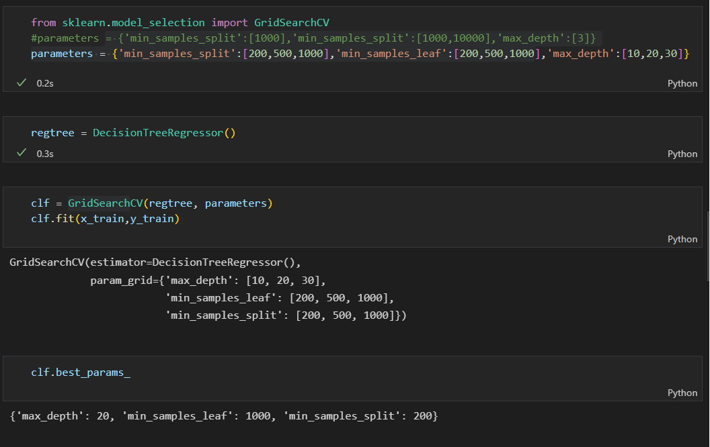

<br>

**Step 3**: Having the best hyperparameters for the model, we observed that the measure of the quality of the model that we were using R2 varied a lot between one execution and another. Therefore, we decided to carry out a cross-validation, so that with different sections of Train and Test, it performs an average and returns a much more reliable value of R2.

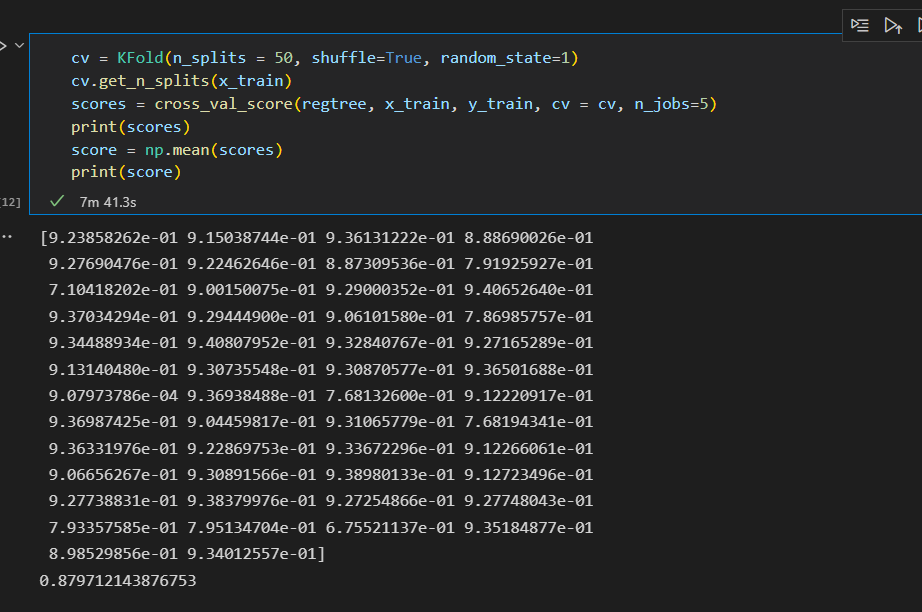

<br>

**Step 4**: We export the model and load it in a streamlit to be able to make the rate predictions from that same place

Link application to predict the rate: https://mangoru-taxi-trips-amount-prediction-streamlit-app-0z2yr7.streamlitapp.com/

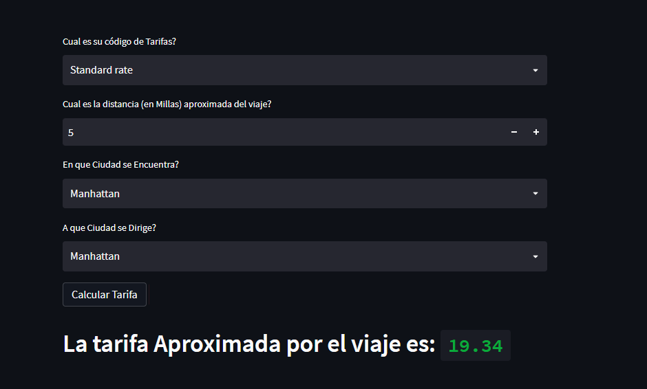