# Reporte ETL - Dataset Taxis NYC Enero 2018

La extracción de los datos ha sido realizada desde la Web [Click Aquí](https://www1.nyc.gov/site/tlc/about/tlc-trip-record-data.page). Asi ha sido la carga inicial de los datos y de exploracion.

La tabla contiene casi 8.7 millones de registros y 19 columnas de las cuales hay dos ["congestion_surcharge", "airport_fee"] con 99.9% de valores nulos.

En la tabla con la columna "airport_fee" se ha decidido eliminarla porque no agregar valor a los datos, ya que hace referencia a una tarifa y sus valores son cero por lo tanto es irrelevante para el análisis.

Ahora con la segunda columna "congestion_surcharge", al ser una tarifa que se aplica a las demoras por congestionamientos se ha decidido convertir los valores __Nulos__ en __Cero__, de esta forma se puede utilizar en otros analisis si en el viaje de taxi ocurren o no congestionamientos.

La compañía que ha realizado más viajes en el mes ha sido __VeriFone Inc.__ con mas de 4.914.553 en comparación con __Creative Mobile Technologies__ con 3.846.134

Se ha creado una columna llamada "Tiempo Viaje" para conocer si hay valores que no sean reales o positivos. Estos valores negativos han sido convertidos a Cero y los tiempos de viajes que ha superado los 100.000 segundos fueron covertidos a Cero porque representan mas de 1 día de viaje.

## Tiempo de Viaje - Con Outliers

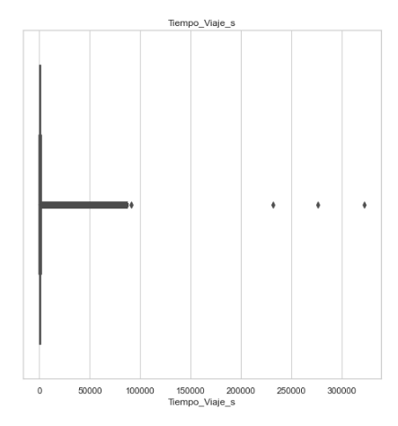

## Tiempo de Viaje - Sin Outliers

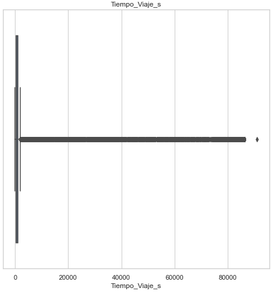

Otra observación ha sido la distancia de viaje o "trip_distance" donde los valores outlier o superiores a 25.000 millas fueron considerados como errores en el registro, y fueron convertidos a Cero. Porque son distancias superiores, por ejemplo un registro que tiene mas de 175.000 millas recorridas.

## Distancia de Viaje - Con Outliers

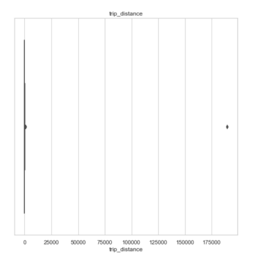

## Distancia de Viaje - Sin Outliers


En las columnas relaciondas a las tarifas y recargos como las siguientes:

- fare_amount
- extra
- mta_tax
- tip_amount
- tolls_amount
- improvement_surcharge
- total_amount

Se han detectado que existen valores negativos y hay opciones que han consirerado, la primera es que hay registros erróneos y otros valores que pueden ser descuentos (Consultar). Por lo tanto se ha decidido convertir todos los registros a positivos para no perder el dato ya que es de utilidad para los análisis. Como recomendación, poder agregar una columna adicional que pueda ser llamada "Descuentos".

## Tarifas - Monto Total

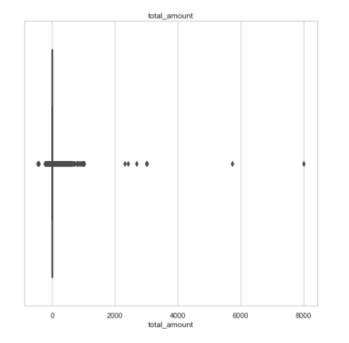

## Tarifas - Propinas

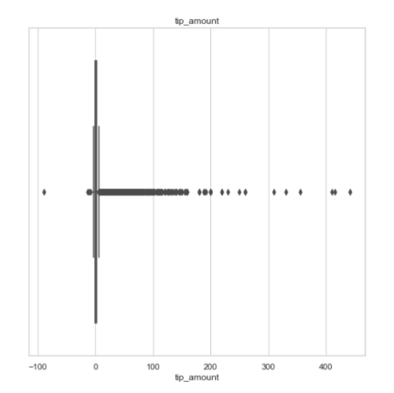


## Correccion de valores de Borough

En esta seccion decicimos eliminar 189 mil valores de la tabla Taxis ya que los elementos no se contectan con la tabla de Borough. No tenemos Borough, Zone, ni la latitud o longitud.

## Correccion de valores de Rate

Observamos en el diccionario de datos que tenemos 6 valores distintos de Rate_Code, pero en el anilisis de datos observamos un septimo. Valor 99 que contiene unos 30 datos. Decicimos eliminar estos datos ya que son un inpedimento a la hora de hacer las conexiones para el datawarehouse.

<br>

# Datawarehouse
A la hora de armar la base de datos, decidimos trabjar con postgresql y airflow. Todos estos procesos estaran montados en docker.
Para empezar investigamos en la documentacion de airflow y descargamos el archivo docker_compose que trajo airflow y el postgresql con el trabajamos. Con postgresql armamos la base de datos con sus tablas, llaves primarias y llaves foraneas. El airflow lo utilizaremos para orquestar la automatizacion del proceso desde el ETL(con trabajo sobre los valores alejados y los nulos) como tambien la creacion de las tablas y la carga de los datos.

<br>

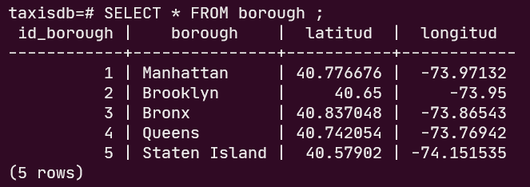

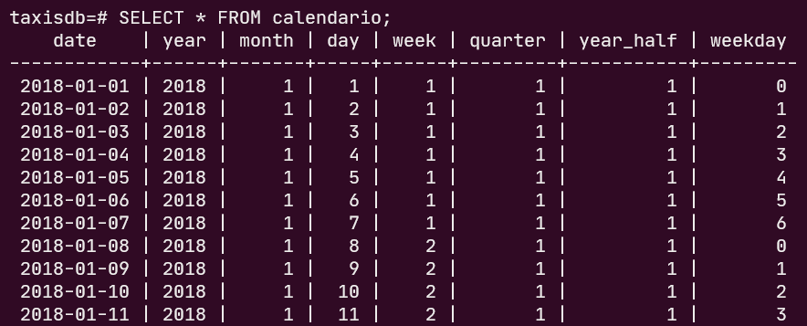

<br>

## Creacion de la base de datos
Trabajamos con la tabla __trip_data__ que tendra todos los datos obtenidos del dataset Taxis.csv, tendra una primarykey llamada "id_trip_data".
trip_data cuenta con 5 llavaes foraneas:
<br>
- __Rate:__ Entre id_date_code de la tabla trip_data y id_rate de la tabla rate. Contalbiliza los tipos de tarifa de los viajes
- __Pay_tipe:__ Entre id_pay_tipe de la tabla trip data y id_pay_tipe de la tabla pay_tipe. Contabiliza los metodos de pagos de los usuarios.
- __Vendor:__ Entre id_vendor de la tabla trip data y id_vendor de la tabla vendor. Contabiliza la empresa que realizo el viaje.
- __Localtion:__ Con esta tabla tenemos una doble llave foranea. La primera para la columna pu_location y la segunda para do_location ambas de la tabla trip_data y se conectan con la columna id_location de la tabla location. En estas columnas estamos mostrando lo localizacion del taxi en el inicio del viaje y la localizacion en su final.

<br>

Para continuar tenemos la tabla __weather__, esta tabla cuenta con una llave primaria llamada id_weather, que informa sobre cada una de las situaciones climaticas en los lugares correspondientes en un periodo de una hora. Ademas cuenta con 1 llave foranea:
<br>
- __Borough:__ La columna id_borough de la tabla weather con la tabla id_borough de la tabla borough. Para coordinar la ubicacion de cada situacion climatica registrada en su tabla correspondiente.


Terminando el analisis de las llaves foraneas tenemos la tabla __borough__, donde la llave primaria es el id_borough y posee una llave foranea:
<br>
- __Location:__ La id_borough de la tabla borough con la columna id_borough de la tabla location. Para coordinar las jerarquias entre los borough y las zonas.

<br>

Ademas tenemos las tablas __calendario__ donde la clave primaria es la fecha, y tenemos las columnas sobre dia, semana, mes, trimestre, etc.

La tabla __location__ donde organizamos las jerarquias y las relaciones entre las zonas y los borough.

La tabla __rate__ donde anotamos los tipos de tarifas, la tabla __pay_tipe__ y la tabla __vender__ donde vemos la empresa que realizo el viaje.

<br>

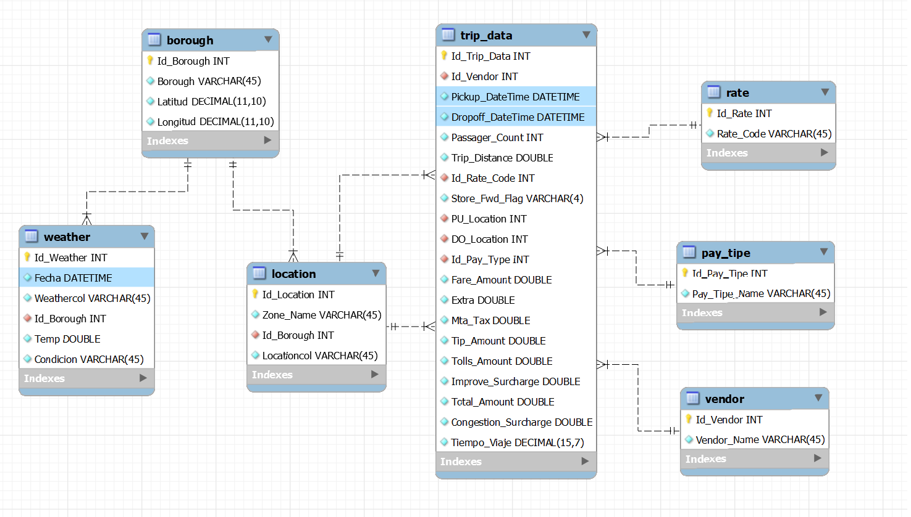

<br>

# Reglas de negocio
<br>

1. Las unidades de taxis deben poder proporcionar el servicio de viaje a sus pasajeros.

La fecha y hora de **tpep_dropoff_datetime** no puede inferior al de **tpep_pickup_datetime**.

```python
if **tpep_dropoff_datetime** < **tpep_pickup_datetime** = DROP
```

Los valores en las distancias en **trip_distance** deben ser positivos.

```python
if **trip_distance < 0 = abs(trip_distance)**
```

1. El pasajero debe poder solicitar una unidad de taxi para su viaje.

Los valores en la tarifa de **fare_amount** deben ser positivos.

```python
if **fare_amount** < 0 = abs(**fare_amount**)
```

1. Los viajes deben suceder en zonas y barrios existentes.

Las ubicaciones de subida **pu_location** y bajada **do_location** de cada viaje deben pertenecer a una ubicación en la tabla **location**.

```python
**taxis**[**pu_location**] is not **location**[**id_location] =** DROP
**taxis**[**do_location**] is not **location**[**id_location] =** DROP
```

1. Las tarifas son establecidas por un código dado por la locación final del viaje.

El código de tarifa de cada viaje **ratecodeid** debe estar en un rango del 1 al 6.

```python
if **ratecodeid** < 1 and **ratecodeid >** 6 = DROP
```

1. El pasajero puede decidir su método de pago preferente.

El código de pago de cada viaje **id_payment** debe estar en un rango del 1 al 6. 

```python
if **id_payment** < 1 and **id_payment >** 6 = DROP
```

1. Cada viaje genera una ganancia dependiendo de la tarifa dada.

El valor en **total_amount** debe ser mayor o igual que en **fare_amount**.

```python
if **total_amount < fare_amount =** DROP
```
<br>

# Carga Incremental de los datos

Para el proceso de cargar incremental de los meses sucesivos hemos decidido usar los servicios de airflow, ya que con esta tecnologia podemos ejecutar en paso a paso y en intervalos de tiempo, la extraccion, carga y transformacionn de nuestros datos.
<br>

Ademas crearemos una base de datos en postgresql que conectaremos con airflow. 
<br>

Paso 1: Creamos el esquema.
<br>

Paso 2: Cargamos las tablas Vendor, Rate, Payment, Borough y Location (Tablas que seran creadas y cargadas una sola vez)

<br>

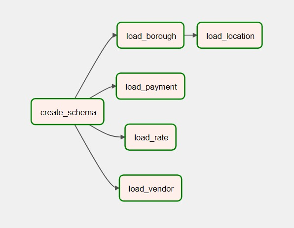

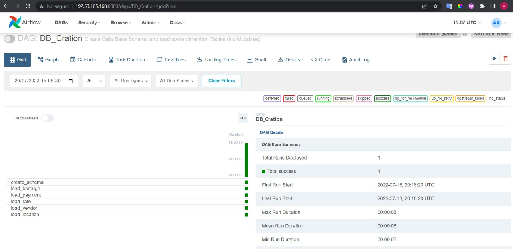

<br>
Paso 3: Luego se ejecutan dos procesos el ETL_taxi_trips y ETL_weather.
<br>

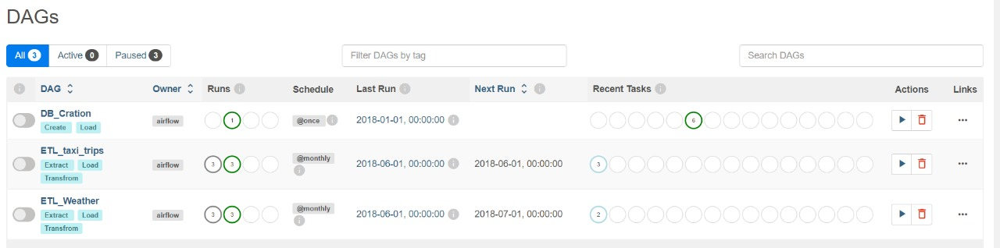

Paso 4: El proceso ETL_taxis_trips cuenta con 3 etapas, extraccion de los datos desde la pagina (extrac_trip), transformacion de los datos con python (transform_trip) y la carga a los datos a la base en postgressql (load_trip).

<br>

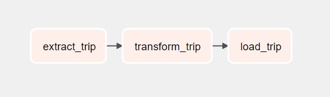

Paso 5: El proceso ETL_weather cuenta con 2 etapas, extraccion y transformacion de los datos desde la pagina (extrac_transform_weather)y la carga a los datos a la base en postgressql (load_weather).

<br>

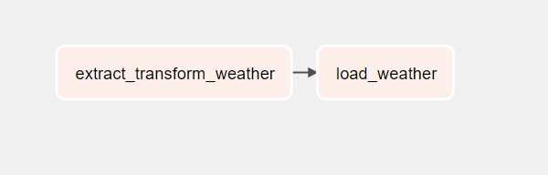

<br>

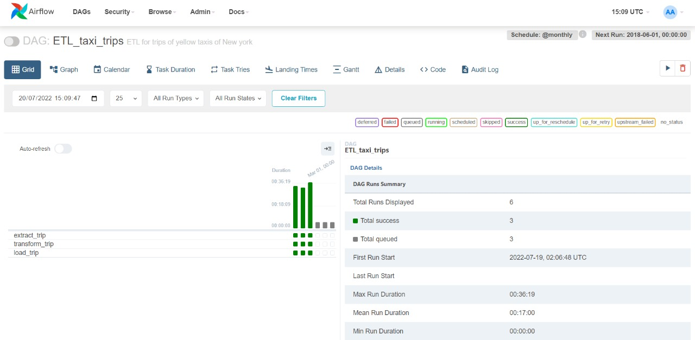

<br>

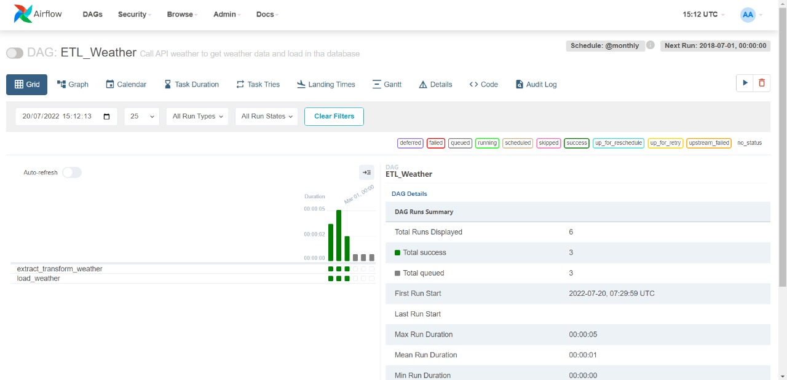


<br>

# Analisis en Power BI

En esta seccion realizaremos un analisis grafico de los datos y buscaremos obtener algunas conclusiones sobre pasos de inversion a seguir.

<br>
Observamos que entre los meses de Enero-Febrero-Marzo tenemos 26 millones de regristros con 4000 viajes por dia. Los viajes estan distribuidos en 5 zonas, la duracion promedio del viaje es de 15 min aprox y las tarifas promedio son de $12.14.

<br>

A la hora de analizar una posible incursion en el mercado de taxis, creemos que el dato mas importante es la ubicacion. Mas de la mitad de los taxis salen de la zona de Manhattan. 
Esta region tiene 12 veces mas viajes que las otras 4 juntas y genera 4.5 veces los ingresos de las otras 4 zonas sumadas. Por lo tanto si hay una ubicacion donde es recomendable para una empresa empezar es en Manhattan. 

<br>

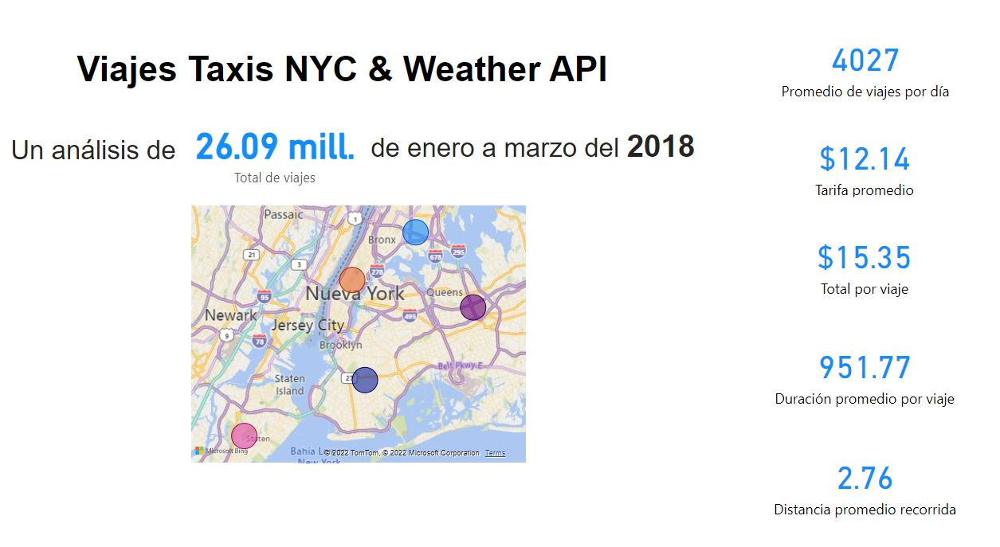

<br>

Ademas es importante considerar los horarios de trabajo de la empresa. Nosotros encontramos importante la franja horaria desde las 8 am hasta las 11 pm, ya que es el tiempo donde mas requerimientos de taxis habran y podra ser mas aprovechable.
Considerando tambien que un dia donde los consumos de taxis en cantidad y dinero son menores es el dia Domingo.

<br>

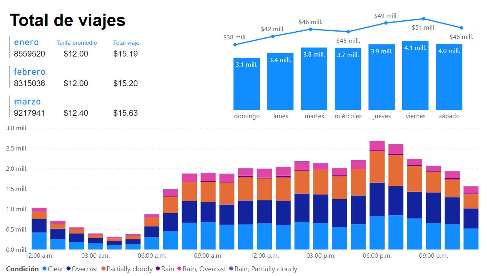

<br>

En el analisis por zonas podemos observar nuevamente el amplio margen de ventaja entre Manthattan y el resto. Ademas podemos notar que las condiciones climaticas no suelen tener un fuerte impacto en la demanda de taxis.

<br>

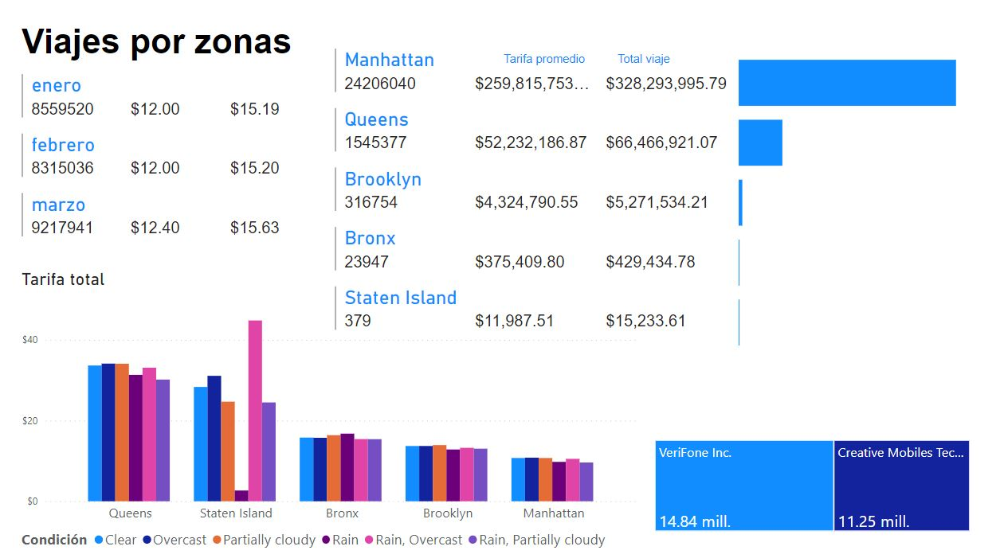

<br>

En esta seccion vemos la importancia del aceptar el pago con tarjeta, casi un requisito excluyente. De no ser asi podrian ver muy mermados los ingresos de la empresa. A la hora de analizar los tipos tarifas, consideramos que es importante tener consideraciones para viajes al aeropuerto, estos casos seran por amplian diferencia escasos.

<br>

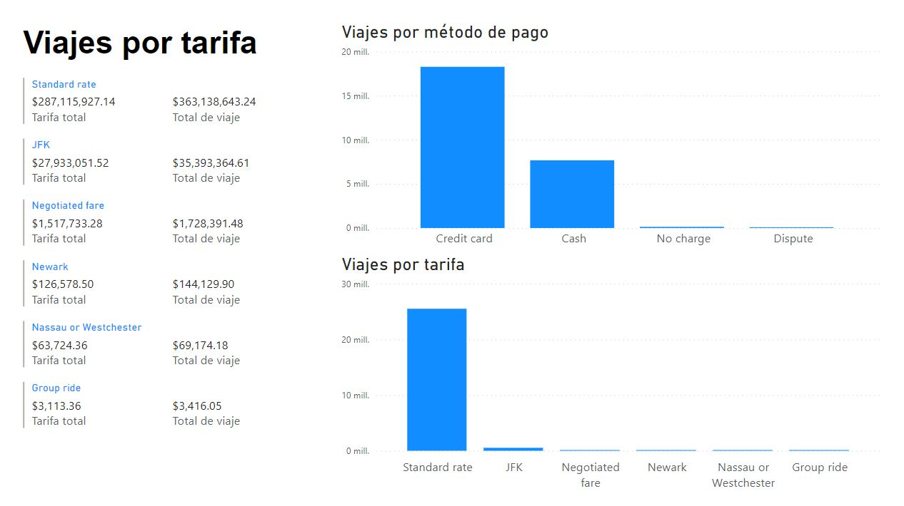

A la hora de analizar la situacion por clima vemos una clara tendencia. La mayor cantidad de taxis son requeridos cuando las temperatureas oscilan entre los 30ºF y 45ºF. Pero cuando salimos de ese rango de temperatura los valores de uso de taxis descienden mucho, manteniendose relvantes en los rangos 15ºF-30ºF y 45ºF-60ºF. Pero volviendose casi insignificantes en los rangos menores de 15ºF o mayores de 60ºF.

<br>

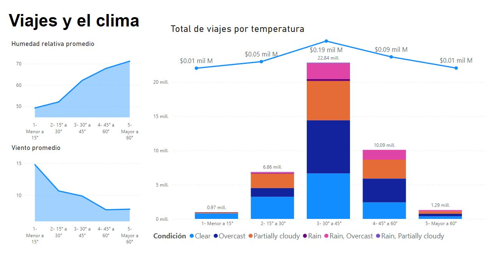
