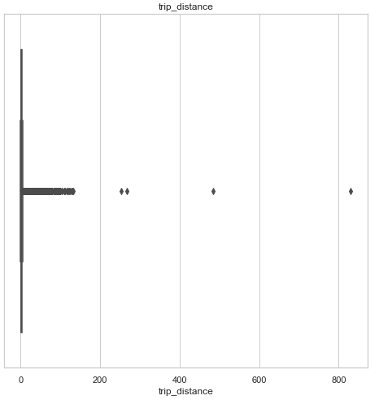

# Reporte ETL - Dataset Taxis NYC Enero 2018

La extracción de los datos ha sido realizada desde la Web [Click Aquí](https://www1.nyc.gov/site/tlc/about/tlc-trip-record-data.page). Asi ha sido la carga inicial de los datos y de exploracion.

La tabla contiene casi 8.7 millones de registros y 19 columnas de las cuales hay dos ["congestion_surcharge", "airport_fee"] con 99.9% de valores nulos.

En la tabla con la columna "airport_fee" se ha decidido eliminarla porque no agregar valor a los datos, ya que hace referencia a una tarifa y sus valores son cero por lo tanto es irrelevante para el análisis.

Ahora con la segunda columna "congestion_surcharge", al ser una tarifa que se aplica a las demoras por congestionamientos se ha decidido convertir los valores __Nulos__ en __Cero__, de esta forma se puede utilizar en otros analisis si en el viaje de taxi ocurren o no congestionamientos.

La compañía que ha realizado más viajes en el mes ha sido __VeriFone Inc.__ con mas de 4.914.553 en comparación con __Creative Mobile Technologies__ con 3.846.134

Se ha creado una columna llamada "Tiempo Viaje" para conocer si hay valores que no sean reales o positivos. Estos valores negativos han sido convertidos a Cero y los tiempos de viajes que ha superado los 100.000 segundos fueron covertidos a Cero porque representan mas de 1 día de viaje.

## Tiempo de Viaje - Con Outliers

## Tiempo de Viaje - Sin Outliers

Otra observación ha sido la distancia de viaje o "trip_distance" donde los valores outlier o superiores a 25.000 millas fueron considerados como errores en el registro, y fueron convertidos a Cero. Porque son distancias superiores, por ejemplo un registro que tiene mas de 175.000 millas recorridas.

## Distancia de Viaje - Con Outliers

## Distancia de Viaje - Sin Outliers

En las columnas relaciondas a las tarifas y recargos como las siguientes:

- fare_amount
- extra
- mta_tax
- tip_amount
- tolls_amount
- improvement_surcharge
- total_amount

Se han detectado que existen valores negativos y hay opciones que han consirerado, la primera es que hay registros erróneos y otros valores que pueden ser descuentos (Consultar). Por lo tanto se ha decidido convertir todos los registros a positivos para no perder el dato ya que es de utilidad para los análisis. Como recomendación, poder agregar una columna adicional que pueda ser llamada "Descuentos".

## Tarifas - Monto Total

## Tarifas - Propinas

