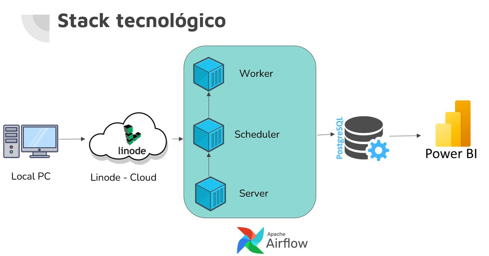
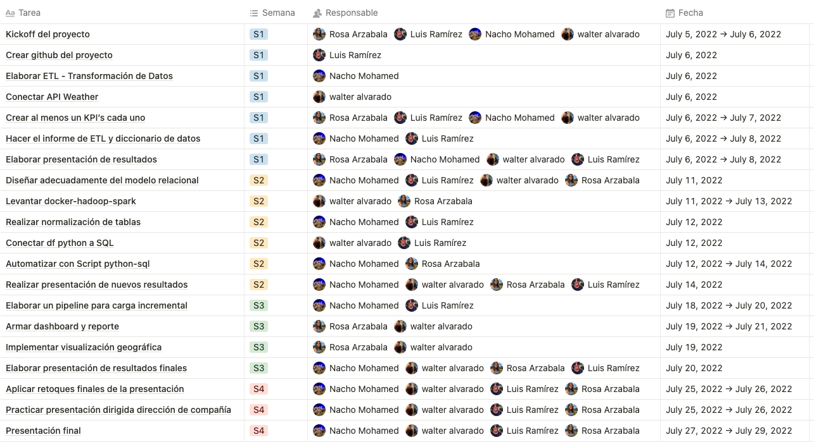
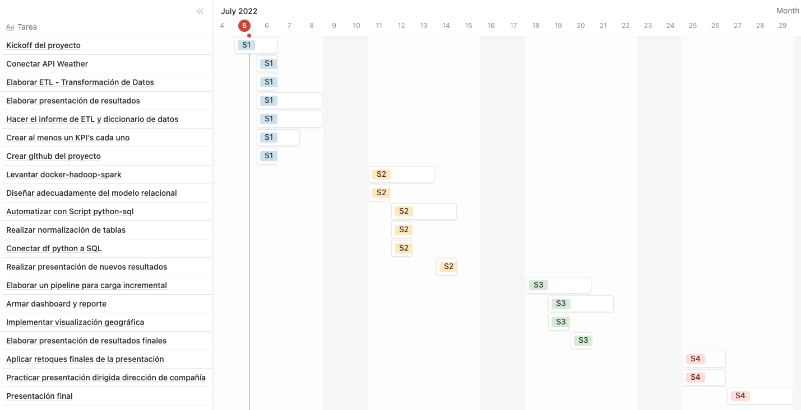

# ****Taxis NYC & WEATHER API****

## Visión general

Una empresa de servicios de transporte de pasajeros que actualmente se encuentra operando en el sector de micros de media y larga distancia, está interesada en invertir en el sector de transporte de pasajeros con automóviles.

Debido a que sería una unidad de negocio nueva, se pretende hacer un análisis preliminar del movimiento de los taxis en la ciudad de Nueva York, para poder obtener un marco de referencia y poder tomar decisiones bien fundamentadas.

## Objetivos

- Acompañar al negocio en el proceso de toma de decisión de invertir
- Establecer KPI’s que sustentan las recomendaciones de inversión entregadas
- Desarrollar un Datawarehouse automatizado con carga inicial e incremental
- Elaborar dashboard y reportes del proceso realizado y los resultados obtenidos
- Armar una presentación con storytelling de la obtención de los resultados finales

## Alcance

- Diseño y creación del Datawarehouse
- Creación de los Pipelines que alimentan el DW
- Presentación final con storytelling

## Fuera de alcance

- Implementar modelo de Machine Learning
- Herramientas No-SQL

## Solución propuesta

## Diseños a entregar

- Documento kickoff del proyecto
- Roadmap del proyecto en Notion
- Diccionario de datos
- Informe de exploración de datos
- Datawarehouse para la carga inicial
- Pipeline para la carga incremental del DW
- Presentación de análisis de datos y métricas
- Reporte final con análisis de inversión y visualización

 

## Roles y responsabilidades

 

## Diagrama de Gantt

 

## Documentos relacionados

Repo del proyecto: https://github.com/Ramirez-L/Proyecto_Taxis_Grupo_11

Proyecto Henry: https://github.com/soyHenry/DS-Proyecto_Grupal_TaxisNYC

Arquitectura: https://github.com/Marcel-Jan/docker-hadoop-spark

Notion del proyecto: https://www.notion.so/2222c531028f45d6828f236dcc107802