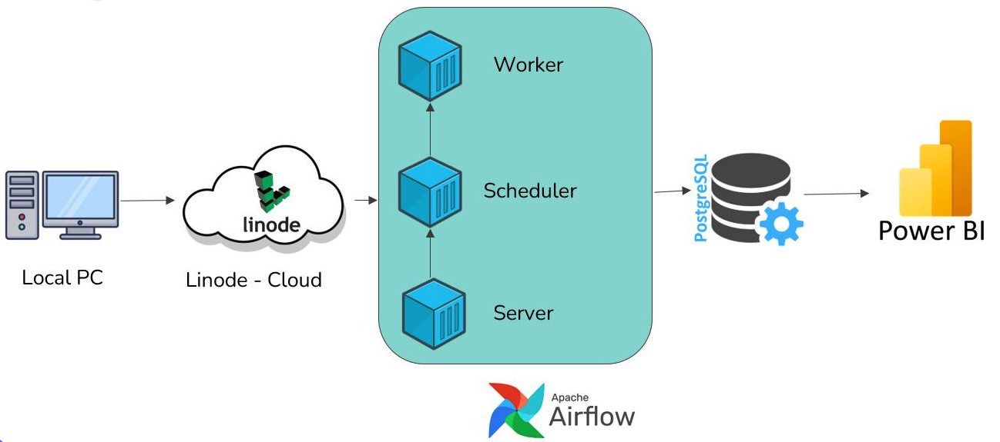
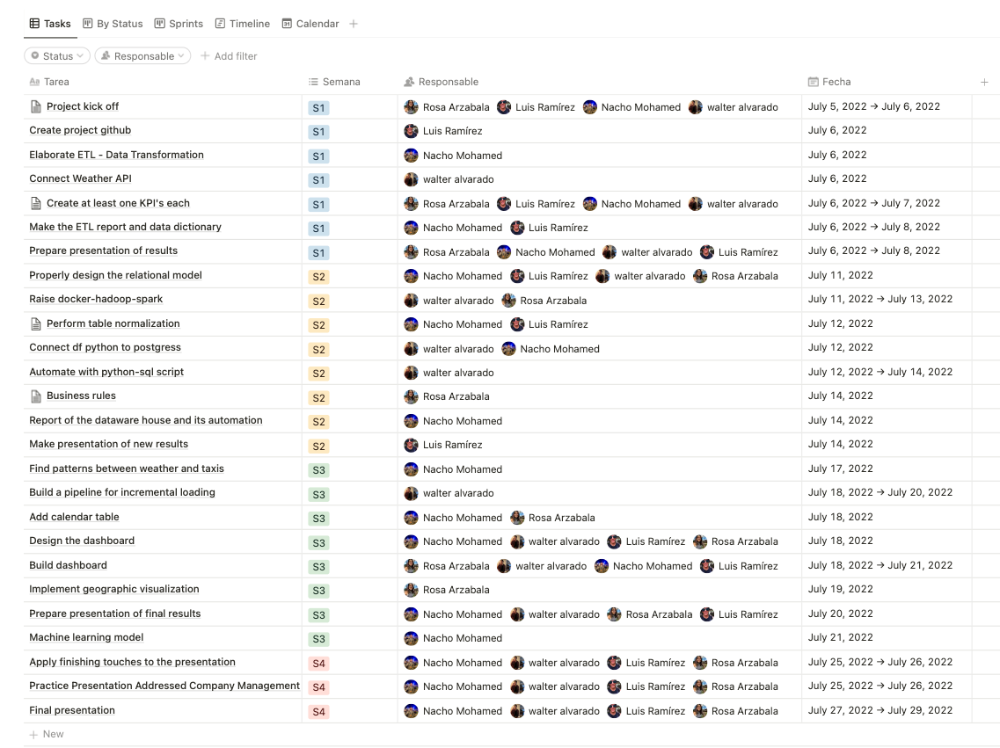

# Project kickoff

## Overview

A passenger transport service company that is currently operating in the medium and long-distance bus sector is interested in investing in the passenger car transport sector.

Since it would be a new business unit, it is intended to make a preliminary analysis of the movement of taxis in the city of New York, in order to obtain a frame of reference and be able to make well-founded decisions.

## Goals

- Accompany the business in the decision-making process to invest
- Establish KPI's that support the investment recommendations
- Implement an ETL process in the Data Warehouse with incremental loading
- Prepare dashboard and reports to present the results obtained

## Scope

- Design and creation of the DW
- Implement pipelines that feed the DW
- Final presentation with storytelling

## Out of reach

- Machine Learning model
- Big Data tools

## Solution

## Deliverable

- Project kickoff document
- Roadmap in Notion
- Data Dictionary
- Data Exploratory Report
- Data Warehouse
- Pipeline with incremental loading 
- Presentation of analysis and metrics
 

## Roles and responsibilities

 

## Related documents

Repository: https://github.com/rosaarz/nyc-taxis-analysis.git 

Notion template: [https://www.notion.so/2222c531028f45d68](https://skinny-redcurrant-066.notion.site/2222c531028f45d6828f236dcc107802?v=8744aa4fd4874102a67ac8b5a54af459)

Henry Project: https://github.com/soyHenry/DS-Proyecto_Grupal_TaxisNYC